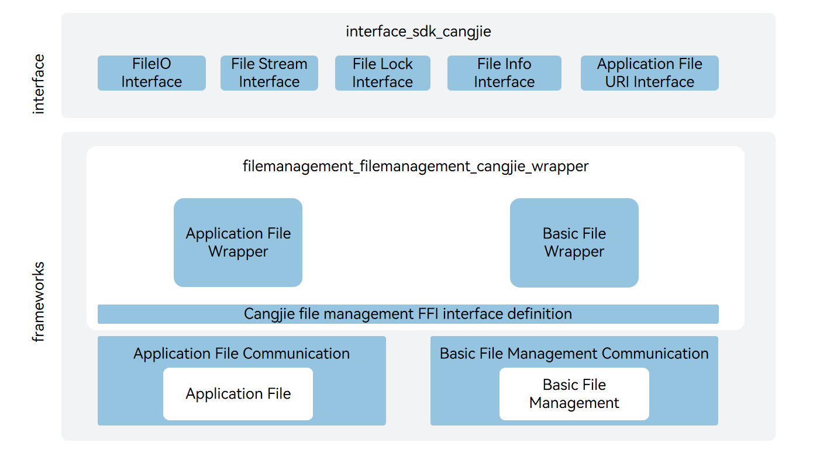

# filemanagement_cangjie_wrapper

## Introduction

The filemanagement_cangjie_wrapper is a Cangjie API encapsulated on OpenHarmony based on the capabilities of the file management Subsystem. The file management subsystem provides a complete file management solution for OpenHarmony. It provides secure and easy-to-use file access and comprehensive file management capabilities. The currently open Graphic Cangjie api only supports standard devices.

## System Architecture

**Figure 1** Architecture of the file management subsystem


- 文件IO接口：provide file creation, access and random read-write interface;
- 文件流接口：provide the capability interface for reading and writing files in a streaming manner;
- 文件锁接口：provide file blocking and non-blocking interfaces for applying shared lock or exclusive lock and unlocking;
- 文件信息接口：provide basic statistical information interface including file size, access permission and modification time;
- 应用文件URI接口：provides the URI interface for obtaining the application itself;
- 仓颉文件管理FFI接口定义：responsible for defining the C interoperable Changjie interface, which is used to implement the Changjie file management capability;
- 应用文件：provide secure sandbox quarantine technology for applications to ensure minimized permissions on the basis of application data security;
- 基础文件：Provides the ability to create, modify, and access files.

## Directory Structure

```
foundation/filemanagement/filemanagement_cangjie_wrapper
├── figures               # architecture pictures
├── kit                   # Cangjie File Management kit code
│   └── CoreFileKit       # Cangjie CoreFileKit code implementation
├── ohos                  # Cangjie File Management code
│   └── file              # Cangjie File code implementation
└── test                  # Cangjie test code
```

## Constraints

Constraints on local I/O APIs:

-   Only UTF-8/16 encoding is supported.
-   The URIs cannot include external storage directories.

## Usage

The current distributed soft bus Cangjie interface provides the following functions:

- basic file access capability;
- document information acquisition capability;

Compared with ArkTS, the following functions are not supported at the moment:

- Storage management functions;
- Common file function;
- Distributed capabilities;
- Application file sharing capabilities.

For filemanagement-related APIs, please refer to :

-   [ohos.file.fs (File Management)](https://gitcode.com/openharmony-sig/arkcompiler_cangjie_ark_interop/blob/master/doc/API_Reference/source_en/apis/CoreFileKit/cj-apis-file_fs.md)
-   [ohos.file.fileuri (File URI)](https://gitcode.com/openharmony-sig/arkcompiler_cangjie_ark_interop/blob/master/doc/API_Reference/source_en/apis/CoreFileKit/cj-apis-file_fileuri.md)

For relevant guidance, please refer to [Introduction to Core File Kit](https://gitcode.com/openharmony-sig/arkcompiler_cangjie_ark_interop/blob/master/doc/Dev_Guide/source_en/file-management/cj-core-file-kit-intro.md).

## Code Contribution

Developers are welcome to contribute code, documentation, etc. For specific contribution processes and methods, please refer to [Code Contribution](https://gitcode.com/openharmony/docs/blob/master/en/contribute/code-contribution.md).

## Repositories Involved

[filemanagement_app_file_service](https://gitee.com/openharmony/filemanagement_app_file_service)

[filemanagement_file_api](https://gitee.com/openharmony/filemanagement_file_api)

[cangjie_ark_interop](https://gitcode.com/openharmony-sig/arkcompiler_cangjie_ark_interop/blob/master/README.md)

[hiviewdfx_cangjie_wrapper](https://gitcode.com/openharmony-sig/hiviewdfx_hiviewdfx_cangjie_wrapper/blob/master/README.md)
