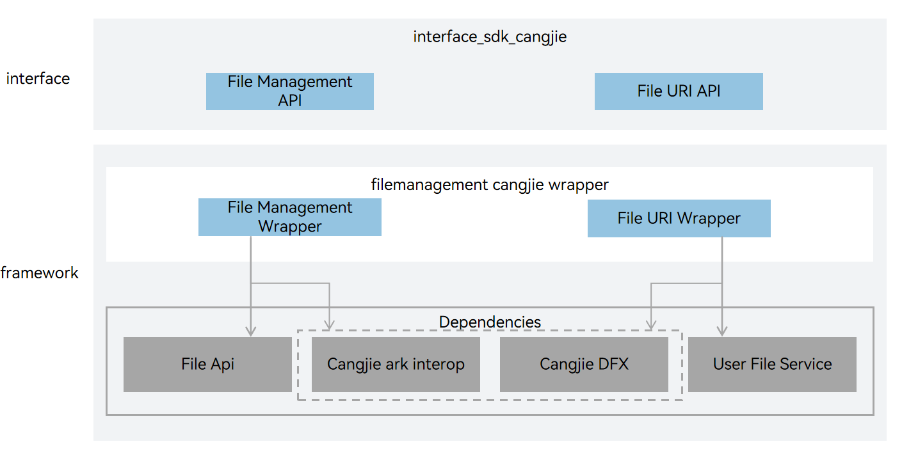

# filemanagement_cangjie_wrapper

## Introduction

The filemanagement_cangjie_wrapper is a Cangjie API encapsulated on OpenHarmony based on the capabilities of the file management Subsystem. The file management subsystem provides a complete file management solution for OpenHarmony. It provides secure and easy-to-use file access and comprehensive file management capabilities.

## System Architecture

**Figure 1** Architecture of the file management subsystem


## Directory Structure

```
foundation/filemanagement/filemanagement_cangjie_wrapper
├── ohos             # Cangjie File Management code
├── kit              # Cangjie kit code
├── figures          # architecture pictures
```

## Constraints

The currently open Graphic Cangjie api only supports standard devices.

Constraints on local I/O APIs:

-   Only UTF-8/16 encoding is supported.
-   The URIs cannot include external storage directories.

## Usage

### Available APIs

Currently, the File Api provides APIs for accessing local files and directories. The following table describes the API types classified by function.

**Table 1** API types

Currently, the File Api provides APIs for accessing local files and directories. The following table describes the API types classified by function.

| API Type         | Function                         | Related Module            | Example API (Class Name.Method Name)         |
| ------------ | ---------------------------------- | ------------------- | -------------------------- |
| Basic file API | Creates, modifies, and accesses files, and changes file permissions based on the specified absolute paths or file descriptors. | @ohos.file.fs | FileIo.access<br/>FileIo.open<br/>FileIo.moveFile |
| Application file URI API | Users are required to provide the sandbox path and the application's own URI | @ohos.file.fileuri | getUriFromPath |
| Basic directory API | Reads directories and determines file types based on the specified absolute paths. | @ohos.file.fs | FileIo.listFile |
| Basic statistical API | Collects basic statistics including the file size, access permission, and modification time based on the specified absolute paths. | @ohos.file.fs | Stat.stat |
| Streaming file API | Reads and writes data streams of files based on the specified absolute paths or file descriptors. | @ohos.file.fs | FileIo.createStream<br/>FileIo.fdopenStream |
| File lock API | Provide the ability to apply shared or exclusive locks, as well as unlock them, in a file blocking or non blocking manner. | @ohos.file.fs | File.tryLock<br/>File.unlock |

The open interface can specify the mode parameter to enable the corresponding functional permissions, as described in the following table.

**Table 2** OpenMode types

| Name       | Type  | Value  | Description         |
| ---------- | ----- | ------ | ------------------- |
| READ_ONLY  | Int64 | 0o0    | Open for read-only. |
| WRITE_ONLY | Int64 | 0o1    | Open for writie-only. |
| READ_WRITE | Int64 | 0o2    | Open for both reading and writing. |
| CREATE     | Int64 | 0o100  | If the file does not exist, create the file. |
| TRUNC      | Int64 | 0o1000 | If the file exists and is opened in write only or read-write mode, its length is cropped to zero. |
| APPEND     | Int64 | 0o2000 | Open in append mode, and subsequent writes will be appended to the end of the file. |
| NONBLOCK   | Int64 | 0o4000 | If the path points to a FIFO, block special file, or character special file, then this open and subsequent IO operations will be non blocking. |
| DIR        | Int64 | 0o200000  | If the path does not point to a directory, an error occurs. |
| NOFOLLOW   | Int64 | 0o400000  | If the path points to a symbolic link, an error occurs. |
| SYNC       | Int64 | 0o4010000 | Open files in synchronous IO mode. |

The file filtering configuration item type supports the use of the listFile interface, as described in the following table.

**Table 3**  Filter

| Name        | Type           | Description                        |
| ----------- | -------------- | ---------------------------------- |
| suffix      | Array\<String> | The file suffix matches perfectly, with OR relationships between the keywords. |
| displayName | Array\<String> | Fuzzy matching of file names, OR relationships between various keywords.    |
| mimeType    | Array\<String> | The mime type matches perfectly, with OR relationships between each keyword.  |
| fileSizeOver       | ?Int64  | File size matching, files greater than or equal to the specified size. |
| lastModifiedAfter  | ?Float64 | The latest modification time of the file matches the file at the specified time point and beyond. |
| excludeMedia       | Bool    | Whether you want to exclude files already in the media. |

For filemanagement-related APIs, please refer to :

-   [ohos.file.fs (File Management)](https://gitcode.com/openharmony-sig/arkcompiler_cangjie_ark_interop/blob/master/doc/API_Reference/source_en/apis/CoreFileKit/cj-apis-file_fs.md)
-   [ohos.file.fileuri (File URI)](https://gitcode.com/openharmony-sig/arkcompiler_cangjie_ark_interop/blob/master/doc/API_Reference/source_en/apis/CoreFileKit/cj-apis-file_fileuri.md)

For relevant guidance, please refer to [Introduction to Core File Kit](https://gitcode.com/openharmony-sig/arkcompiler_cangjie_ark_interop/blob/master/doc/Dev_Guide/source_en/file-management/cj-core-file-kit-intro.md).

## Code Contribution

Developers are welcome to contribute code, documentation, etc. For specific contribution processes and methods, please refer to [Code Contribution](https://gitcode.com/openharmony/docs/blob/master/en/contribute/code-contribution.md).

## Repositories Involved

**Application file management**

[filemanagement_app_file_service](https://gitee.com/openharmony/filemanagement_app_file_service)

**File management APIs**

[filemanagement_file_api](https://gitee.com/openharmony/filemanagement_file_api)