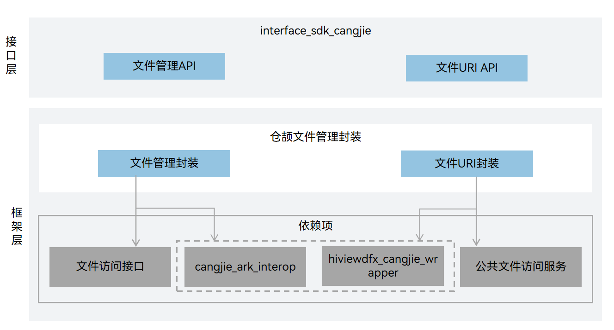

# 文件管理仓颉接口

## 简介

文件管理仓颉接口是在 OpenHarmony 上基于文件管理子系统能力之上封装的仓颉API。文件管理子系统为OpenHarmony提供一套完整的文件数据管理解决方案，提供安全、易用的文件访问能力和完善的文件存储管理能力。

## 系统架构

**图 1**  文件管理仓颉架构图


## 目录

```
foundation/filemanagement/filemanagement_cangjie_wrapper
├── ohos             # 仓颉文件管理接口实现
├── kit              # 仓颉kit化代码
├── figures          # 存放readme中的架构图
```

## 约束

当前开放的文件管理仓颉接口仅支持standard设备。

本地 IO 接口

-   目前仅支持 UTF-8/16 编码；
-   目前 URI 暂不支持外部存储目录。

## 使用说明

### 接口说明

当前文件管理按照功能可瓜分为如下几种类型：

**表 1** 接口类型表

| 接口类型         | 接口用途                         | 相关模块            | 接口示例（类名.方法名）         |
| ------------ | ---------------------------------- | ------------------- | -------------------------- |
| 基本文件接口 | 需要用户提供沙箱路径或文件描述符（fd），提供创建、修改及访问文件的能力 | @ohos.file.fs | FileIo.access<br/>FileIo.open<br/>FileIo.moveFile |
| 获取文件应用URI | 需要用户提供沙箱路径，提供应用自己的URI | @ohos.file.fileuri | getUriFromPath |
| 获取目录项 | 需要用户提供沙箱路径，提供读取目录及过滤目录文件的能力 | @ohos.file.fs | FileIo.listFile |
| 获取文件信息接口 | 需要用户提供沙箱路径，提供包括文件大小、访问权限、修改时间在内的基本统计信息 | @ohos.file.fs | Stat.stat |
| 流接口 | 需要用户提供沙箱路径或文件描述符，提供流式读写文件的能力 | @ohos.file.fs | FileIo.createStream<br/>FileIo.fdopenStream |
| 文件锁接口 | 提供文件阻塞式、非阻塞式施加共享锁或独占锁，及解锁的能力 | @ohos.file.fs | File.tryLock<br/>File.unlock |

open接口可以指定mode参数以打开相应功能权限，说明如下：

**表 2** OpenMode类型表

| 名称       | 类型   | 值     | 说明         |
| ---------- | ----- | ------ | -------------------------- |
| READ_ONLY  | Int64 | 0o0    | 只读打开。 |
| WRITE_ONLY | Int64 | 0o1    | 只写打开。 |
| READ_WRITE | Int64 | 0o2    | 读写打开。 |
| CREATE     | Int64 | 0o100  | 若文件不存在，则创建文件。 |
| TRUNC      | Int64 | 0o1000 | 如果文件存在且以只写或读写的方式打开文件，则将其长度裁剪为零。 |
| APPEND     | Int64 | 0o2000 | 以追加方式打开，后续写将追加到文件末尾。 |
| NONBLOCK   | Int64 | 0o4000 | 如果path指向FIFO、块特殊文件或字符特殊文件，则本次打开及后续 IO 进行非阻塞操作。 |
| DIR        | Int64 | 0o200000  | 如果path不指向目录，则出错。 |
| NOFOLLOW   | Int64 | 0o400000  | 如果path指向符号链接，则出错。 |
| SYNC       | Int64 | 0o4010000 | 以同步IO的方式打开文件。 |

文件过滤配置项类型，支持listFile接口使用，说明如下：

**表 3**  Filter

| 名称        | 类型             | 说明                               |
| ----------- | --------------- | ---------------------------------- |
| suffix      | Array\<String> | 文件后缀名完全匹配，各个关键词OR关系。 |
| displayName | Array\<String> | 文件名模糊匹配，各个关键词OR关系。    |
| mimeType    | Array\<String> | mime类型完全匹配，各个关键词OR关系。  |
| fileSizeOver       | ?Int64  | 文件大小匹配，大于等于指定大小的文件。 |
| lastModifiedAfter  | ?Float64 | 文件最近修改时间匹配，在指定时间点及之后的文件。 |
| excludeMedia       | Bool    | 是否排除Media中已有的文件。 |

文件管理相关API请参见：

-   [ohos.file.fs（文件管理）](https://gitcode.com/openharmony-sig/arkcompiler_cangjie_ark_interop/blob/master/doc/API_Reference/source_zh_cn/apis/CoreFileKit/cj-apis-file_fs.md)
-   [ohos.file.fileuri](https://gitcode.com/openharmony-sig/arkcompiler_cangjie_ark_interop/blob/master/doc/API_Reference/source_zh_cn/apis/CoreFileKit/cj-apis-file_fileuri.md)

相关指导请参见[Core File Kit简介](https://gitcode.com/openharmony-sig/arkcompiler_cangjie_ark_interop/blob/master/doc/Dev_Guide/source_zh_cn/file-management/cj-core-file-kit-intro.md).

## 参与贡献

欢迎广大开发者贡献代码、文档等，具体的贡献流程和方式请参见[参与贡献](https://gitcode.com/openharmony/docs/blob/master/zh-cn/contribute/%E5%8F%82%E4%B8%8E%E8%B4%A1%E7%8C%AE.md)

## 相关仓

**应用文件管理**

[filemanagement_app_file_service](https://gitee.com/openharmony/filemanagement_app_file_service/blob/master/README_ZH.md)

**文件接口**

[filemanagement_file_api](https://gitee.com/openharmony/filemanagement_file_api/blob/master/README_zh.md)
